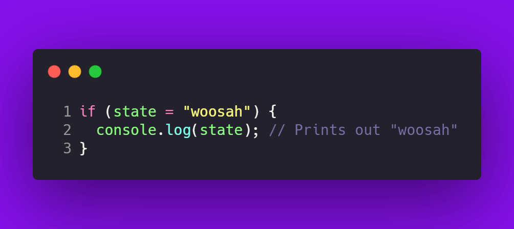

---
author:
  email: dimaslanjaka@gmail.com
  name: Dimas Lanjaka
categories:
  - programming
comments: true
cover: https://miro.medium.com/max/912/1*Gdlo9wVkOuzsA8iUqXoLEg.png
date: 2022-10-06T11:40:09+07:00
description: js validate and assign online inside if, js assign variable inside
  if bracket, How to declare a variable inside brackets
lang: en
photos:
  - https://miro.medium.com/max/912/1*Gdlo9wVkOuzsA8iUqXoLEg.png
tags:
  - js
  - html
thumbnail: https://miro.medium.com/max/912/1*Gdlo9wVkOuzsA8iUqXoLEg.png
title: How to declare a variable inside if else brackets
type: post
updated: 2023-08-08T14:45:08+07:00
wordcount: 1069
---

<h2>How to declare a variable inside brackets?</h2>

<b>Might you have questions like below?</b>
<ol>
  <li>js validate and assign online inside if</li>
  <li>js assign variable inside if bracket</li>
  <li>is it wrong to declare variables within an if-block?</li>
  <li>How to declare a variable inside brackets?</li>
  <li>is it wrong to stick to the ES6 spec and do what I did?</li>
</ol>

<i>You read the right article</i>

<h3>Basically if-else format like an below codes</h3>
<pre>
  <code>
    if (condition) {
      var foo = { bar: 'abcd' };
    }
  </code>
</pre>

<p>
  However, JavaScript doesn't have scope blocking. I understand that foo will be null if the condition is not true. Later in the code if I do something like foo.bar I see that the bar cannot be read with an undefined error.
</p>
<p>That being said, is it wrong to stick to the ES6 spec and do what I did?</p>

<h3>Playground with examples</h3>
<h5>HTML</h5>
<pre><code>
&lt;span id=&quot;ntrue&quot;&gt;&lt;/span&gt;
&lt;span id=&quot;nfalse&quot;&gt;&lt;/span&gt;
</code></pre>
<h5>Javascript</h5>
<pre><code>
// declare Mutable variable
let n = false;
// assign variable as true
if ((n = 2 &gt; 1)) {
  // print
  document.getElementById(&quot;ntrue&quot;).textContent = String(n);
}
// assign variable as false
if (!(n = 2 &gt; 4)) {
  // print
  document.getElementById(&quot;nfalse&quot;).textContent = String(n);
}
</code></pre>

<h5>The result</h5>

N=(n = 2 > 1) <span id="ntrue"></span> <br>
N=!(n = 2 > 4) <span id="nfalse"></span>
<script>
  // declare Mutable variable
  let n = false;
  // assign variable as true
  if ((n = 2 > 1)) {
    // print
    document.getElementById("ntrue").textContent = String(n);
  }
  // assign variable as false
  if (!(n = 2 > 4)) {
    // print
    document.getElementById("nfalse").textContent = String(n);
  }
</script>

### Example using RegExp

```javascript
const regex = /(?:(?:(\d+):)?(?:(\d+):))?(\d+)(?:\.(\d+))?/gm;

// Alternative syntax using RegExp constructor
// const regex = new RegExp('(?:(?:(\\d+):)?(?:(\\d+):))?(\\d+)(?:\\.(\\d+))?', 'gm')

const str = `1:1.1`;
let m;
// this loop running until regex.exec return null
while ((m = regex.exec(str)) !== null) {
    // This is necessary to avoid infinite loops with zero-width matches
    if (m.index === regex.lastIndex) {
        regex.lastIndex++;
    }

    // The result can be accessed through the `m`-variable.
    m.forEach((match, groupIndex) => {
        console.log(`Found match, group ${groupIndex}: ${match}`);
    });
}
```

### Example Images



## Conclusion
Defining or assigning and validating variable inside if-else scope is allowed, the example like above codes.