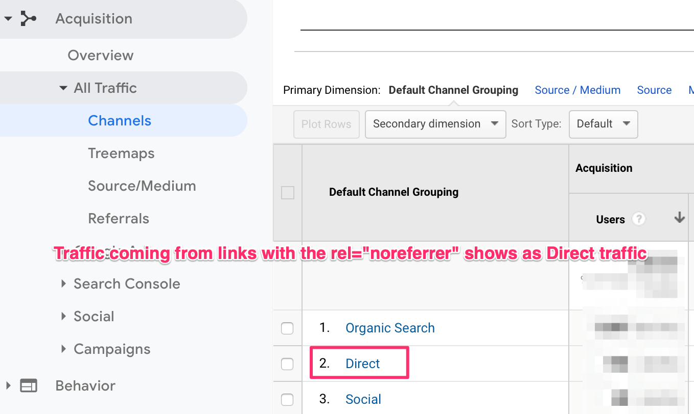

Definition and Usage of REL attribute on anchor/hyperlink
--------------------

The `rel` attribute indicates the relationship between the current document and the linked document.

Only used if the `href` attribute is present.

**Tip:** Search engines can use this attribute to get more information about a link!

* * * * *

## NOREFERER
In short, the **`noreferrer` link type hides referrer information when the link is clicked**. A link with the `noreferrer` link type looks something like this:

```
<a href="http://www.webmanajemen.com" rel="noreferrer">Click here for more info</a>

```

If someone arrives at your site from a link that uses this link type, your analytics won't show who refered that link. Instead, it will mistakenly show as direct traffic in your acquisition channels report.

**If you have an external link to someone else's site you don't trust and you want to hide referrer information then you can combine both and use**

```
<a href="http://example.com/sample_page/" rel="noreferrer nofollow">Other Domain Link</a>

```

I advise you to use `nofollow` links for the following content:

-   **Links in comments or on forums** - Anything that has user-generated content is likely to be a source of spam. Even if you carefully moderate, things will slip through.
-   **Advertisements & sponsored links** - Any links that are meant to be advertisements or are part of a sponsorship arrangement must be nofollowed.
-   **Paid links** - If you charge in any way for a link (directory submission, quality assessment, reviews, etc.), `nofollow` the outbound links

### NOREFERER ON NETWORK

`noreferrer` doesn't just block the HTTP referrer header, it also prevents a [Javascript exploit involving window.opener](https://stackoverflow.com/questions/40593632/use-window-open-but-block-use-of-window-opener)

> `<a href="http://someurl.here" target="_blank">Link</a>`\
>
> Looks innocuous enough, but there's a hole because, by default, the page that's being opened is allowing the opened page to call back into it via window.opener. There are some restrictions, being cross-domain, but there's still some mischief that can be done
>
> `window.opener.location = 'http://gotcha.badstuff';`

With `noreferrer` most browsers will disallow the `window.opener` exploit

### NOREFERER GOOGLE ANALYTICS AFFECT
noreferer should indicated as direct traffic on analytics


### NOREFERER CONCLUSION
Use the `rel="noreferrer"` attribute on outbound links if you don't want other websites to know that you are linking to them. I can't think of a good reason why you would want to do this, but yes.

**Do not** use the `rel="noreferrer"` attribute for internal links. This can mess up your Google Analytics reports.

## LINK TOOLBARS

LINK relationship values reserved for toolbars are:

REL=Home

The link references a `home page` or the `top of some hierarchy`.

### TOC
REL=ToC

The link references a document serving as a `table of contents`.

### INDEX
REL=Index

The link references a document providing an `index for the current document`.

### GLOSSARY
REL=Glossary

The link references a document providing a glossary of terms that pertain to the current document.

### COPYRIGHT
REL=Copyright

The link references a copyright statement for the current document.

### UP
REL=Up

When the document forms part of a hierarchy, this link references the immediate parent of the current document.

### NEXT
REL=Next

The link references the next document to visit in a guided tour.

### PREVIOUS
REL=Previous

The link references the previous document in a guided tour.

### HELP
REL=Help

The link references a document offering help, e.g. describing the wider context and offering further links to relevant documents. This is aimed at reorienting users who have lost their way.

### BOOKMARK
REL=Bookmark

Bookmarks are used to provide direct links to key entry points into an extended document. The TITLE attribute may be used to label the bookmark. Several bookmarks may be defined in each document, and provide a means for orienting users in extended documents.

An example of toolbar LINK elements:

```html
<LINK REL=Previous HREF=doc31.html>
<LINK REL=Next HREF=doc33.html>
<LINK REL=Bookmark TITLE="Order Form" HREF=doc56.html>
```

Source toolbar from: [The Head Element and Related Elements](http://www.w3.org/MarkUp/html3/dochead.html)

## SPONSORED

rel="sponsored"

Links that are advertisements or paid placements (commonly called `paid links`) are flagged with the value "Sponsored". [More information on Google's stance on paid links](https://developers.google.com/search/docs/advanced/guidelines/link-schemes).

```html
<a rel="sponsored" href="https://cheese.webmanajemen.com/Pinneapple_Apple_Pen">Pinneapple Apple Pen</a>
```

> **Note:** The `nofollow` attribute was [previously recommended](https://developers.google.com/search/blog/2019/09/evolving-nofollow-new-ways-to-identify) for these types of links and is still an acceptable way to flag them, though `sponsored` is preferred.

## UGC

rel="ugc"

We recommend marking user-generated content (UGC) links, such as **comments** and **forum posts**, with the ugc value.

```html
<a rel="ugc" href="https://cheese.webmanajemen.com/Pinneapple_Apple_Pen">Pinneapple Apple Pen</a>
```

## NOFOLLOW
rel="nofollow"

Use the `nofollow` value when other values don't apply, and you'd rather Google not associate your site with, or crawl the linked page from, your site. For links within your own site, use the [robots.txt `disallow` rule](https://developers.google.com/search/docs/crawling-indexing/robots/robots_txt#disallow).

```html
<a rel="nofollow" href="https://cheese.webmanajemen.com/Pinneapple_Apple_Pen">Pinneapple Apple Pen</a>
```

## Crawable Links SEO
**Can follow:**

-   `<a href="https://example.com">`
-   `<a href="/relative/path/file">`

**Can't follow:**

-   `<a routerLink="some/path">`
-   `<span href="https://example.com">`
-   `<a onclick="goto('https://example.com')">`

## Resolvable Links SEO

Ensure that the URL linked to by your `<a>` tag is an actual web address that Googlebot can send requests to, for example:

**Can resolve:**

-   `https://example.com/stuff`
-   `/products`
-   `/products.php?id=123`

**Can't resolve:**

-   `javascript:goTo('products')`
-   `javascript:window.location.href='/products'`
-   `#`