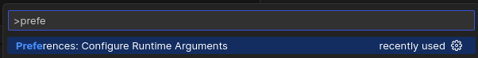
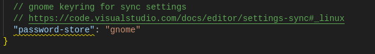

## Ensure gnome-keyring is running

```bash
$ systemctl --user status gnome-keyring-daemon
● gnome-keyring-daemon.service - GNOME Keyring daemon
     Loaded: loaded (/usr/lib/systemd/user/gnome-keyring-daemon.service; enabled; preset: enabled)
     Active: active (running) since Thu 2023-06-15 12:36:32 CEST; 3h 43min ago
TriggeredBy: ● gnome-keyring-daemon.socket
   Main PID: 16317 (gnome-keyring-d)
      Tasks: 4 (limit: 67352)
     Memory: 3.5M
        CPU: 1.067s
     CGroup: /user.slice/user-1000.slice/user@1000.service/app.slice/gnome-keyring-daemon.service
             └─16317 /usr/bin/gnome-keyring-daemon --foreground --components=pkcs11,secrets --control-directory=/run/user/1000/keyring
```

Otherwise
### enable `gnome-keyring-daemon` manually

```bash
gnome-keyring-daemon --replace --daemonize --components=pkcs11,secrets,ssh
```

#### Show installed `gnome-keyring`

```bash
$ dpkg -l | grep gnome-keyring
ii  gnome-keyring                                               42.1-1+b2                                            amd64        GNOME keyring services (daemon and tools)
ii  gnome-keyring-pkcs11:amd64                                  42.1-1+b2                                            amd64        GNOME keyring module for the PKCS#11 module loading library
ii  libgnome-keyring-common                                     3.12.0-1                                             all          GNOME keyring services library - data files
ii  libgnome-keyring-dev                                        3.12.0-1+b2                                          amd64        Development files for GNOME keyring service
ii  libgnome-keyring0:amd64                                     3.12.0-1+b2                                          amd64        GNOME keyring services library
ii  libpam-gnome-keyring:amd64                                  42.1-1+b2                                            amd64        PAM module to unlock the GNOME keyring upon login
```

#### Show installed `libsecret`

```bash
$ dpkg -l | grep libsecret
ii  libsecret-1-0:amd64                                         0.20.5-3                                             amd64        Secret store
ii  libsecret-common                                            0.20.5-3                                             all          Secret store (common files)
```

#### Show installed `dbus-x11`

```bash
$ dpkg -l | grep -i dbus-x11
ii  dbus-x11                                                    1.14.6-1                                             amd64        simple interprocess messaging system (X11 deps)
```

## Open VSCode argument settings

open the Command Palette (`Ctrl+Shift+P`) and type **Preferences: Configure Runtime Arguments**



## Add settings

add the setting `"password-store":"gnome"`



## Restart VSCode

after added the password-store to settings, clean restart VSCode.

Close the window (`X`) then re-open VSCode from start menu or desktop icon.

## Relogin

Try relogin VSCode with github or microsoft account