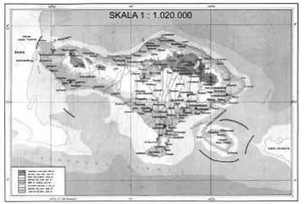

## Arti Skala Pada Peta

Pada gambar di atas tertulis: skala 1 : 1.020.000. Apakah arti skala 1 : 1.020.000 tersebut?

Skala 1: 1.020.000 artinya tiap 1 cm pada peta diatas mewakili 1.020.000 cm jarak sebenarnya.

## Rumus Skala
Singkatan

> - JSB = Jarak Sebenarnya
> - s   = Skala
> - JPP = Jarak Pada Peta

Menentukan jarak pada peta

\[ JPP = Skala \times JSB \]

Menentukan jarak sebenarnya

\[ JSB = { JPP \over Skala } \]

Menentukan Skala

\[ Skala = { JPP \over JSB } \]

## Menentukan skala dari jarak peta dan jarak sebenarnya
Jarak dari kota A ke B pada peta adalah `5cm`, namun jarak sebenarnya adalah `100km`. Berapakah skala pada peta ? (yang ditanyakan adalah `skala`).
Maka rumusnya

\[s = {JPP \over JSB} = {5 cm \over 100 km} = {5 cm \over 10.000.000 cm} = {1 \over 2,000.000} \]

Jadi skalanya adalah **1 : 2.000.000**

Contoh soal lain untuk **Menentukan skala dari jarak peta dan jarak sebenarnya**

**Diketahui :**

Jarak pada peta = 12 cm

Jarak sebenarnya = 144 km = 14.400.000 cm (konversi `km` ke `cm`)

Ditanya : **Skala ?**

**Jawab :**

Skala = Jarak pada peta : Jarak sebenarnya

Skala = 12 : 14.400.000

Skala = 1 : 1.200.000

Sehingga, skalanya adalah 1 : 1.200.000

Penjelasan rumusnya

\[ Skala = {12 cm \over 14.400.000 cm} \]
\[ Skala = {12 \over 14.000.000} = {12 \div 12 = 1 \over 14.000.000 \div 12 = 1.200.00} = 1:1.200.000 \]

## Menentukan jarak sebenarnya berdasarkan jarak pada peta dan skala pada peta

> - JSB = Jarak Sebenarnya
> - JPP = Jarak Pada Peta

***Diketahui :***

Jarak pada peta = 17 cm

Skala pada peta = 1 : 1.500.000

Ditanya : **Jarak sebenarnya ?**

**Jawab :**

Skala = Jarak pada peta : Jarak sebenarnya

\[ Skala = { JPP \over JSB } \]

Jarak sebenarnya = Jarak pada peta : skala

\[ JSB = { JPP \\ \colon Skala } \]

Jarak sebenarnya = 17 : (1 : 1.500.000)

Jarak sebenarnya = 17 x 1.500.000

\[ JSB = { 17 \colon (1 \colon 1500000) } = { 17 \times 1500000 } \]

Jarak sebenarnya = 25.500.000 cm

Jarak sebenarnya = 255 km

\[ JSB = { 25500000 cm \over 100000 cm } = 255 km \]

\[ 1 km = 100.000 cm \]

Sehingga, jarak yang sebenarnya adalah 255 km.

\[ JSB = 255 km \]

## Contoh-contoh Soal Pembahasan Skala Peta

### Soal 1
Jarak antara kota A dan B pada suatu peta adalah 6 cm. Jarak sebenarnya antara kota A dan B tersebut adalah 120 km. **Berapakah skala peta tersebut** ?

\[ Skala = { JPP \over JSB } \]
\[ Skala = { 6cm \over 120 km } = { 6cm \over 12000000 cm } = 1 \colon 2000000 \]

Jadi, skala pada peta tersebut adalah `1 : 2.000.000`.

### Soal 2
Jarak antara kota C dan D pada peta adalah 6 cm. Jika skala pada peta yang digunakan adalah 1:500.000, bagaimana cara mencari **jarak sebenarnya kedua kota tersebut** ?

Jawab:

Jarak sebenarnya= Ukuran pada peta : Skala

Jarak sebenarnya= 6 : (1:500.000) = 6 x 500.000 = 3.000.000 cm

Jadi, jarak sebenarnya antara kota A dan B adalah 3.000.000 cm atau 30 km.

### Soal 3
Diketahui jarak sebenarnya dari kota A ke kota B adalah 120 km, jika terdapat sebuah peta dengan skala 1: 400.000, maka jarak pada peta dari kota A ke kota B adalah?

Jawab:

Jarak pada peta = Skala x Jarak Sebenarnya

Jarak pada peta = 1 banding 400.000 x 120 km

Jarak pada peta = 1/400.000 x 12.000.000 cm

Jarak pada peta = 30 cm

